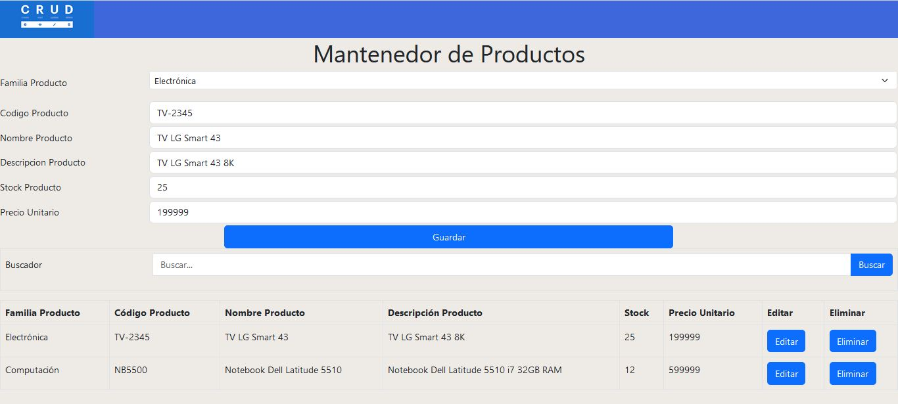

# Proyecto-CRUD

#  **Proyecto Mantenedor Productos CRUD y DOM**



## *Mantenedor para registro de productos computacionales haciando uso de CRUD en Local Storage y DOM:
---
# **MANTENEDOR DE PRODUCTOS**

* Esta pagina es un mantenedor de Ingreso de Productos Computaciónales, Electrónica y Electrodomésticos, el cual involucra las 4 operaciones CRUD,
* realizando la persistencia de la informacion en windows.localStorage y utilizando la estructura de objetos DOM.
* Los campos requeridos son Tipo Familia Producto, Codigo Producto, Nombre Producto, Descripción Producto, Stock, Precio Unitario, la información de Productos
* almacenados se muestra en una Grilla para facilitar la visualización, ademas cuenta con un buscador de Productos


[mauriespinoza.github.io] https://mauriespinoza.github.io/CRUD/

## Inicio 🚀

Estas instrucciones te ayudarán a obtener una copia del proyecto y a ejecutarlo en tu máquina local para fines de desarrollo y prueba.

### Pre-requisitos 📋

No se requieren instalaciones adicionales para ejecutar este proyecto, solo necesitarás un navegador web actualizado.

### Instalación 🔧

Sigue estos pasos para ejecutar el proyecto localmente:

1. Clona este repositorio en tu máquina local.

```bash
git clone https://github.com/mauriespinoza/CRUD.git
```

1. Navega hasta el directorio del proyecto.

```bash
cd nombre-repo
```

1. Abre el archivo `index.html` en tu navegador web.

## Ejecutando las pruebas ⚙️

Este proyecto no cuenta con pruebas automatizadas. Sin embargo, puedes probar manualmente todas las funcionalidades del mantenedor de Productos.

### Analisis de pruebas de extremo a extremo 🔩

Puedes verificar que las productos se creen correctamente, ademas que se puedan editar y eliminarlas adecuadamente. Estos cambios se deberian ver reflejados en el Grilla de Productos

## Implementación 📦

Puedes implementar este proyecto en un servidor web o utilizarlo localmente sin necesidad de implementación adicional.

## Construido con 🛠️

Herramientas utilizadas para crear el proyecto:

* HTML5 - Estructura del sitio web.
* CSS - Estilos y diseño visual customizado y Bootstrap.
* JavaScript - Lógica y funcionalidad del Mantenedor de Productos.
* DOM - Manipulación del árbol de objetos del documento.
* Local Storage - Almacenamiento de datos en el navegador.

## Contribuir 🖇️

Este proyecto es de código abierto y las contribuciones son bienvenidas. Puedes colaborar mejorando el diseño, agregando nuevas funcionalidades o corrigiendo errores. ¡Siéntete libre de enviar tus pull requests!

## Licencia 📄

Este proyecto está bajo la Licencia MIT. Consulta el archivo [LICENSE.md](LICENSE.md) para obtener más detalles.

## Expresiones de gratitud 🎁

Este archivo readme se ha desarrollado utilizando como referencia los siguientes proyectos:									  
